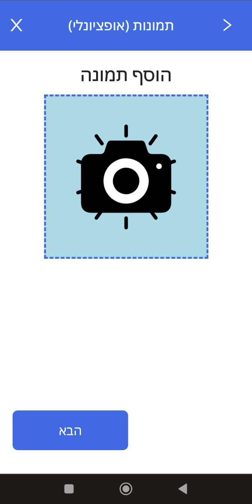

# Hazards reporting app
This site made for Dimona municipal, for the residents of the city.

## Table Of Contents
- [Hazards reporting app](#hazards-reporting-app)
  * [Why did we made it?](#why-did-we-made-it)
  * [App Tools and using](#app-Tools-and-using)
  * [Running the project](#running-the-project)
  * [Screenshots](#screenshots)
    + [Homepage](#homepage)
    + [Upload report images](#upload-report-images)
  * [Technologies](#technologies)
    + [Client-Side](#client-side)
    + [Server-Side](#server-side)
  * [Author](#Author)
  
## Why did we made it?

1. The project was started in Hackaton contest, in 24 hours we created
   a web page that helps people report easily on hazard in the city.
2. Senior officials from the municipality came to the final presentation and
   offered us continue with it,as it can really be an app for them.
3. Our bootcamp course has come to end, and we decide to continue this project
   as our final project of the course!
   
## App Tools and using

1. First, you can report on hazard- this is the main function of the app. The report contain multy-step reporting:
    *Type of the hazard.
    *Upload pictures of the hazard (optional)
    *Location of the hazard (via phone location or manualy)
    *Summarize of the report.
    
2. The second upload option is for suggestions, things you want to say for 
   the municipaly to make the city a better place.
3. The app has alerts page that the municipaly uploads about new thing in the 
   city, that maybe will be helpful for the citizens.
4. There is Admin editor option for adding and deleting alerts.
   
## Running the project

1. Clone the repo.
2. Run `npm install`.
3. Run `npm start`.
4. Navigate to `http://localhost:3000`.

## Screenshots

### Homepage

### Upload report images

## Technologies:

### Client-side:
* React.JS
* React Bootstrap
* React-lottie-player
* React-toastify
* React-router-dom
* React-spring
* Axios

### Server-side:
* Node.JS
* Express
* MongoDB
* Mongoose
* Jwt
* Twilio
* bcryptjs

## Author  

© [Skandalev ](https://github.com/Skandalev)
  [OfekYehoshua ](https://github.com/OfekYehoshua)
  [OrReuben](https://github.com/OrReuben)
  [Natali597](https://github.com/natali597)

